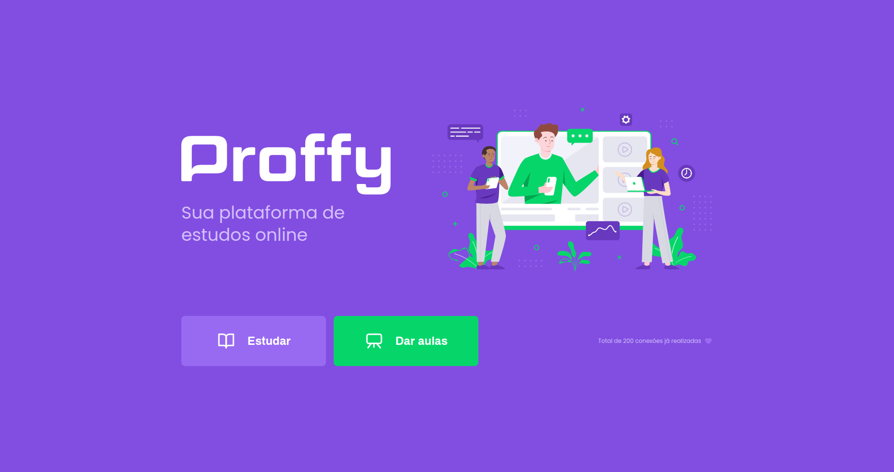
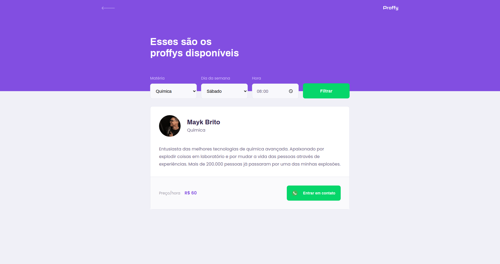

<p align="center" >
    
</p>
<p align="center" >
    </img>
    
</p>

## 📖 Sobre

Este projeto foi desenvolvido durante a [Next Level Week #2](https://nextlevelweek.com/), realizada pela [@Rocketseat](https://github.com/Rocketseat) durante os dias 3 a 9 de Agosto de 2020. Se trata de uma aplicação que conecta pessoas que querem aprender com professores que estão dispostos a dar aulas de acordo com seus horários. Ou seja, nela é possível encontrar alunos e professores.

Todas as aulas foram ministradas pelo [Mayk Brito](https://github.com/maykbrito).

---

## 🖥️ Tecnologias
Esse projeto foi feito utilizando as seguintes tecnologias:

- HTML
- CSS
- JavaScript
- Node.js 
- Nunjucks 
- SQLite

---

## 📸 Screenshots

<div style="display: flex; flex-direction: 'row'; align-items: 'center';">
   
   
</div>

---

## 🔗 Links do projeto

### Notion
- [Front-End](https://www.notion.so/Front-end-ab15ef64dbe7459aba38364cf60af9d2)
- [Back-End](https://www.notion.so/Back-end-4440c9aeda8c47d4856a8e4d4069e379)
- [Banco de Dados](https://www.notion.so/Banco-de-Dados-c6b7589f7ca740979a746d9289ab71f6)

### Figma
- [Proffy - Web](https://www.figma.com/file/GHGS126t7WYjnPZdRKChJF/Proffy-Web)

---

## 🧑‍💻 Como executar
```bash
# Clone o repositório
git clone https://github.com/natansouzaa/Proffy-0.1.git

# Entre no diretório
cd Proffy-1.0

# Baixe as dependências
npm i

# Execute o servidor
npm run dev
```

Feito isso, agora basta abrir seu navegador e acessar `http://localhost:5500/`

---

## 📝 Licença

Esse projeto está sob a licença MIT. Veja o arquivo [LICENSE](LICENSE) para mais detalhes.